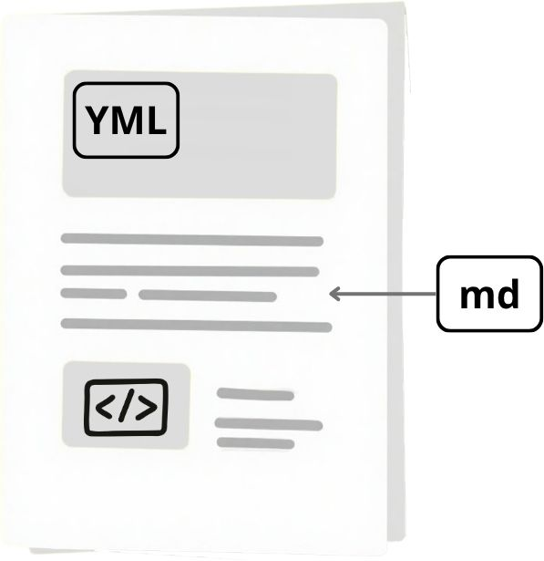

# Proceso de creación de reportes durante la investigación

Tradicionalmente, el proceso de investigación se puede describir de esta manera:

{fig-align="center"}

No obstante, este flujo de información muchas veces es insuficiente para transmitir de manera completa el proceso mediante el cual se genera el conocimiento científico. Por ejemplo, hay pasos que generan conocimiento pero no llegan a los documentos finales (con suerte algunos llegan al material suplementario o a los repositorios de código que acompañan las investigaciones). Por otro lado, la reutilización de los datos suele verse limitada por la falta de documentación adecuada en los conjuntos de datos. Esto es especialmente problemático considerando la gran cantidad de información disponible actualmente, que puede aprovecharse en diferentes áreas o en estudios de síntesis, haciendo más eficiente el uso de los recursos y de los productos de la ciencia


Adicionalmente, la robustez de los resultados en una investigación se beneficia de la confirmación de los mismos, ya sea mediante estudios independientes o mediante la exploración de los análisis para reproducir los resultados de los autores. Sin embargo, no existe una manera estandarizada de comunicar la forma en que se deben ejecutar los análisis en un proyecto de investigación complejo, de forma en que sea reproducible. En algunos casos se hace mediante el texto, en otros mediante archivos con código. Sin embargo, muchas veces la información no es suficiente y cuando queremos repetir o reproducir un análisis (incluso de nuestras propias investigaciones de tiempo atrás) no lo logramos.

{width=60% align=center fig-align="center"}

## Problemas (actualmente)

- Dejar listos los resultados de forma que sean reproducibles requiere un esfuerzo considerable (no se considera el esfuerzo en las métricas de evaluación)
- Los lectores deben descargar los datos/resultados y entender cómo se realizó el análisis (si no está explicado es difícil reconstruir el análisis)
- Puede haber diferencias entre los recursos/paquetes/equipos que tienen los lectores y los autores (muchas veces no se reporta todo el ambiente de trabajo)
- Existen pocas herramientas que ayuden a autores/lectores -> está creciendo

Ejemplos: 

- [Repositorio con todos los elementos pero con dificultades para el lector](https://github.com/spiritu-santi/CF_mig/tree/main)
- [Repositorio explicado](https://github.com/JulietteArchambeau/GOPredEvalPinpin/tree/main)

:::{.callout-note}
**Nota:** Ambos son buenos ejemplos de artículos que pusieron a la disposición de los lectores toda la información necesaria para reproducirlos. La diferencia se encuentra en la manera en la que están explicados.
:::

## Opciones{#sec-opciones} 

Una opción que existe es la generación de documentos que combinen texto/imágenes/diagramas con código y datos. Múltiples documentos se pueden ligar de manera que el análisis completo sea reproducible y las decisiones de los autores sean claras.

- Rmarkdown (R + texto)
- Jupyter Notebooks (python + texto)
- Sweave (Latex + texto)

[Quarto](https://quarto.org/) fue creado como un programa aislado que permite la creación de documentos que mezclan texto con código, además de que está diseñado para permitir el uso de diferentes lenguajes de programación (R, python, Julia, Observable JS). Se puede utilizar en diferentes plataformas y permite la creación de diferentes clases de documentos (presentaciones, html, pdf, artículos, libros, dashboards), que tienen diferentes capacidades (dinámicos vs estáticos).


# Diferencias entre Quarto y Rmarkdown 

En escencia, para los usuarios de R, Quarto funciona de una manera muy similar que R markdown. Quarto fue creado para mejorar la colaboración entre científicos y técnicos. Ahora es un sistema independiente que integra muchas de las funciones que se desarrollaron con R markdown.

Una de las diferencias y ventajas importantes es la compatibilidad de Quarto con múltiples plataformas (p. e. knitr y jupyter notebooks). Quarto es independiente de R, está diseñado para funcionar con distintos lenguajes y está diseñado para acomodar lenguajes que no existen. 

Sin embargo, Rmarkdown seguirá teniendo soporte, aunque algunas de las funcionalidades que desarrollarán en el futuro se realizarán en Quarto.

# Tipos de documentos que se pueden hacer en Quarto

Los formatos básicos que se pueden realizar en Quarto son:

:::{.callout-tip}
Galería de documentos: [Guía de Quarto](https://quarto.org/docs/gallery/) para ver más ejemplos.
:::

## Guía básica de cada formato

- [html](https://quarto.org/docs/output-formats/html-basics.html)
- [pdf](https://quarto.org/docs/output-formats/pdf-basics.html)
- [word](https://quarto.org/docs/output-formats/ms-word.html)
- [diapositivas html](https://quarto.org/docs/presentations/revealjs/)
- [libros](https://quarto.org/docs/books/)
- [dashboards](https://quarto.org/docs/dashboards/)


# Estructura de un documento de Quarto

:::{.columns}
:::{.column left="60%"}

Los documentos básicos de Quarto, sin importar el formato al que van a ser exportados, tienen tres componentes principales:

1. **Encabezado (YML)**: Está definido por `---` al principio y al final. En esta parte se ponen las instrucciones que definen las características principales del documento. Por ejemplo el título, el autor, la fecha,  el formato al que va a ser exportado, el nombre del archivo que queremos exportar. Además se pueden especificar otras opciones que se aplicarán a nivel de documento como el tamaño de las figuras, el comportamiento de los bloques de código, etc.

```{.r}
---
title: "Mi documento"
author: "Sofía Zorrilla"
date: today
format: html
---
```

:::
:::{.column right="40%"}



:::
::: 

2. **Texto (Markdown)**: Este es un lenguaje que principalmente es texto plano pero tiene algunos símbolos que se pueden interpretar fácilmente como html. Veremos la sintáxis más común en el apartado de @sec-introMd. Esta parte del documento incluye imágenes, links y otros recursos digitales que son distintos del código. 


3. **Bloques de código (chunks)**: Son bloques definidos por ```{r} que Quarto puede interpretar y ejecutar como si fuera un script de R (u otros lenguajes de programación). 

```{r}
print("Hola mundo")
```

:::{.callout-note}
**Ejercicio:** 

1. Genera un documento de quarto: Archivo >> Nuevo archivo >> Documento de Quarto

2. Sustituye los elementos de yml que vienen por default para agregar un título, la fecha de hoy, tu nombre y el formato en el que lo vamos a exportar al final.

3. Borra el texto que viene por default.
:::

# Dónde buscar ayuda y más funcionalidades

La mayoría de la documentación básica se puede consultar en la [guía](https://quarto.org/docs/guide/) generada por Posit.

# Introducción al lenguaje de markdown{#sec-introMd}

Es una herramienta para escribir texto simple que originalmente servía para escribir en la web.

> "Markdown is a text-to-HTML conversion tool
for web writers. Markdown allows you to write
using an easy-to-read, easy-to-write plain text
format, then convert it to structurally valid XHTML
(or HTML)." John Gruber

Es un tipo de "lenguaje" que se caracteriza porque se puede leer sin un formato especial, a diferencia de otros lenguajes como HTML.

La sintaxis es simple y no requiere de aprenderse demasiados comandos. En realidad puedes simplemente utilizarlo como documento de texto. 

::: {.callout-tip appearance="simple"}
## Introducción completa a Markdown

En la [página de ayuda](https://quarto.org/docs/authoring/markdown-basics.html#text-formatting) de Quarto puedes encontrar la mayoría de la sintáxis básica que necesitarás. 

:::


::: {.callout-note collapse="true"}
## Sintaxis en el texto
+-----------------------------------------+-----------------------------------------+
| Markdown Syntax                         | Output                                  |
+=========================================+=========================================+
| ``` markdown                            | *italics*, **bold**, ***bold italics*** |
| *italics*, **bold**, ***bold italics*** |                                         |
| ```                                     |                                         |
+-----------------------------------------+-----------------------------------------+
| ``` markdown                            | superscript^2^ / subscript~2~           |
| superscript^2^ / subscript~2~           |                                         |
| ```                                     |                                         |
+-----------------------------------------+-----------------------------------------+
| ``` markdown                            | ~~strikethrough~~                       |
| ~~strikethrough~~                       |                                         |
| ```                                     |                                         |
+-----------------------------------------+-----------------------------------------+
| ``` markdown                            | `verbatim code`                         |
| `verbatim code`                         |                                         |
| ```                                     |                                         |
+-----------------------------------------+-----------------------------------------+
:::

::: {.callout-note collapse="true"}
## Encabezados 

+------------------+-----------------------------------+
| Markdown         | Resultado                         |
+==================+===================================+
| ``` markdown     | # Heading 1 {.heading-output}     |
| # Heading 1      |                                   |
| ```              |                                   |
+------------------+-----------------------------------+
| ``` markdown     | ## Heading 2 {.heading-output}    |
| ## Heading 2     |                                   |
| ```              |                                   |
+------------------+-----------------------------------+
| ``` markdown     | ### Heading 3 {.heading-output}   |
| ### Heading 3    |                                   |
| ```              |                                   |
+------------------+-----------------------------------+
| ``` markdown     | #### Heading 4 {.heading-output}  |
| #### Heading 4   |                                   |
| ```              |                                   |
+------------------+-----------------------------------+
| ``` markdown     | ##### Heading 5 {.heading-output} |
| ##### Heading 5  |                                   |
| ```              |                                   |
+------------------+-----------------------------------+
| ``` markdown     | ###### Heading 6 {.heading-output}|
| ###### Heading 6 |                                   |
| ```              |                                   |
+------------------+-----------------------------------+

: {tbl-colwidths="[50, 50]"}

:::

::: {.callout-note collapse="true"}
## Vínculos e imágenes

+------------------------------------------------------------------------+--------------------------------------------------------------------------------------------------------+
| Markdown Syntax                                                        | Output                                                                                                 |
+========================================================================+========================================================================================================+
| ``` markdown                                                           | <https://quarto.org>                                                                                   |
| <https://quarto.org>                                                   |                                                                                                        |
| ```                                                                    |                                                                                                        |
+------------------------------------------------------------------------+--------------------------------------------------------------------------------------------------------+
| ``` markdown                                                           | [Quarto](https://quarto.org)                                                                           |
| [Quarto](https://quarto.org)                                           |                                                                                                        |
| ```                                                                    |                                                                                                        |
+------------------------------------------------------------------------+--------------------------------------------------------------------------------------------------------+
| ``` markdown                                                           | [Markdown Basics](./markdown-basics.qmd)                                                               |
| [Markdown Basics](./markdown-basics.qmd)                               |                                                                                                        |
| ```                                                                    |                                                                                                        |
+------------------------------------------------------------------------+--------------------------------------------------------------------------------------------------------+
| ``` markdown                                                           | [Markdown Basics - Links & Images](./markdown-basics.qmd#links-images)                                 |
| [Markdown Basics - Links & Images](./markdown-basics.qmd#links-images) |                                                                                                        |
| ```                                                                    |                                                                                                        |
+------------------------------------------------------------------------+--------------------------------------------------------------------------------------------------------+
| ``` markdown                                                           | [Markdown Basics - Links & Images](#links-images)                                                      |
| [Markdown Basics - Links & Images](#links-images)                      |                                                                                                        |
| ```                                                                    |                                                                                                        |
+------------------------------------------------------------------------+--------------------------------------------------------------------------------------------------------+
| ``` markdown                                                           | {fig-alt="A line drawing of an elephant."}                                 |
|                                            |                                                                                                        |
| ```                                                                    |                                                                                                        |
+------------------------------------------------------------------------+--------------------------------------------------------------------------------------------------------+
: {tbl-colwidths="[50, 50]"}


:::

::: {.callout-note collapse="true"}
## Listas

+-----------------------------------+---------------------------------+
| Markdown Syntax                   | Output                          |
+===================================+=================================+
| ``` markdown                      |                                 |
| * unordered list                  | * unordered list                |
|   + sub-item 1                    |   + sub-item 1                  |
|   + sub-item 2                    |   + sub-item 2                  |
|     - sub-sub-item 1              |     - sub-sub-item 1            |
| ```                               |                                 |
+-----------------------------------+---------------------------------+
| ``` markdown                      |                                 |
| *   item 2                        | -   item 2                      |
|                                   |                                 |
|     Continued (indent 4 spaces)   |     Continued (indent 4 spaces) |
| ```                               |                                 |
+-----------------------------------+---------------------------------+
| ``` markdown                      |                                 |
| 1. ordered list                   |  1. ordered list                |
| 2. item 2                         |  2. item 2                      |
|    i) sub-item 1                  |     i) sub-item 1               |
|       A.  sub-sub-item 1          |        A.  sub-sub-item 1       |
| ```                               |                                 |
+-----------------------------------+---------------------------------+
| ```` markdown                     |                                 |
| 1. ordered list                   |  1. ordered list                |
| 2. item 2                         |  2. item 2                      |
|                                   |                                 |
|    ```python                      |     ```python                   |
|    print("Hello, World!")         |     print("Hello, World!")      |
|    ```                            |     ```                         |
|                                   |                                 |
|    A.  sub-sub-item 1             |     A.  sub-sub-item 1          |
| ````                              |                                 |
+-----------------------------------+---------------------------------+
| ``` markdown                      |                                 |
| - [ ] Task 1                      | - [ ] Task 1                    |
| - [x] Task 2                      | - [x] Task 2                    |
| ```                               |                                 |
+-----------------------------------+---------------------------------+
| ``` markdown                      |                                 |
| (@)  A list whose numbering       |  (1) A list whose numbering     |
|                                   |                                 |
| continues after                   |  continues after                |
|                                   |                                 |
| (@)  an interruption              |  (2) an interruption            |
| ```                               |                                 |
+-----------------------------------+---------------------------------+
| ``` markdown                      |                                 |
| ::: {}                            | ::: {}                          |
| 1. A list                         | 1. A list                       |
| :::                               | :::                             |
|                                   |                                 |
| ::: {}                            | ::: {}                          |
| 1. Followed by another list       | 1. Followed by another list     |
| :::                               | :::                             |
| ```                               |                                 |
+-----------------------------------+---------------------------------+
| ``` markdown                      |                                 |
| term                              | term                            |
| : definition                      | : definition                    |
| ```                               |                                 |
+-----------------------------------+---------------------------------+
:::


:::{.callout-note collapse="true"}
## Ecuaciones

+---------------------------+-------------------------+
| Markdown Syntax           | Output                  |
+===========================+=========================+
| ``` markdown              |                         |
| inline math: $E = mc^{2}$ | inline math: $E=mc^{2}$ |
| ```                       |                         |
+---------------------------+-------------------------+
| ``` markdown              |                         |
| display math:             | display math:           |
|                           |                         |
| $$E = mc^{2}$$            | $$E = mc^{2}$$          |
| ```                       |                         |
+---------------------------+-------------------------+
:::


:::{.callout-note}
**Ejercicio:** 

Escribe un ejemplo de sintaxis de markdown en tu documento de cada tipo.

Tip: puedes utilizar el paquete `lorem` para crear texto inventado y rellenar tu documento. 

```{r}
#| eval: false

library(lorem)

ipsum(paragraphs = 10, sentences = 5)
```

:::

# Código en un documento (html y pdf)

Para agregar un bloque de código ("chunk") puedes utilizar el atajo `ctrl + alt + i`

El bloque se compone de diferentes partes
```{{r}} 
#| <opciones del chunk>

<codigo>

```

1. Lenguaje de programación `{r}` - puedes usar `{python}`, `{markdown}`, etc.
2. [Opciones del chunk](https://quarto.org/docs/reference/cells/cells-knitr.html) - se especifican utilizando `#|` al principio, seguido de la etiqueta que queremos utilizar y la opción para esa etitqueta. Por ejemplo para asignar un nombre al chunk usamos `#| label: fig-airquality`
3. Código 

Ejemplo: 

```{r}
#| label: fig-airquality
#| fig-cap: "Temperature and ozone level."
#| warning: false
#| code-summary: Gráfica de líneas Ozono ~ Temperatura
#| code-fold: true

library(ggplot2)

ggplot(airquality, aes(Temp, Ozone)) + 
  geom_point() + 
  geom_smooth(method = "loess")
```

Las opciones más comunes que se pueden modificar en los chunks son:

- `#| label: fig-airquality`: nombre de la figura/tabla/chunk para poder ser referenciados más adelante
- `#| echo: true`: mostrar (true) o no (false) el código
- `#| eval: true`: evaluar o no el código 

:::{.callout-note}
**Ejercicio:** 

Añade un chunk de código para mostrar la gráfica de Temperatura ~ Ozono en tu documento. Incluye las etiquetas de `label`, `fig-cap`, `code-fold`, `code-summary` 

Explora qué pasa cuando renderizas usando distintos valores en `echo` y `eval`
:::


# Imágenes

Las imágenes se pueden incluir usando markdown, html o utilizando código (por ejemplo usando el paquete knitr).

## Markdown 

```markdown


## Ejemplo

{#fig-elefante00}

```

{#fig-elefante00}

Se pueden modificar algunos parámetros de la imagen usando etiquetas:

```markdown
{#fig-elefante0 width="50%" fig-align="center"}

```

{#fig-elefante0 width=50% fig-align="center"}

Se pueden utilizar bloques de HTML (div) para organizar las imágenes en columnas

::: {#fig-elephants layout-ncol=2}

{#fig-elephant1}

{#fig-elephant2}

Elefantes famosos
:::

## HTML


```html

```

 

## Knitr

Se puede utilizar la función include_graphics del paquete knitr para agregar una imagen. Las propiedades de la imagen se controlan por medio de las opciones de chunk.

```{.r}
#| echo: false
#| out-width: 50% 
#| fig-align: center

library(knitr)

knitr::include_graphics("img/elephant.png")
```


```{r}
#| echo: false
#| out-width: 50% 
#| fig-align: center

library(knitr)

knitr::include_graphics("img/elephant.png")
```


:::{.callout-note}
**Ejercicio:** 

1. Busca y descarga en tu directorio de trabajo una imágen que quieras incluir en tu documento.

2. Incorporala con alguna de las maneras mencionadas anteriormente

3. Incluye etiqueta, pie de figura y ajusta el ancho de la imágen.
:::

# Tablas

Las tablas son una parte fundamental de muchos documentos científicos y reportes técnicos. En Quarto pueden construirse de distintas maneras, desde tablas simples escritas manualmente hasta tablas generadas automáticamente a partir de datos en R.

## Tablas simples en Markdown

La forma más sencilla de crear una tabla en Quarto es usando sintaxis Markdown.

```markdown
| Especie         | Región | Individuos |
|:----------------|:------:|------------:|
| Q. rugosa       | Centro | 25          |
| Q. insignis     | Sur    | 12          |
| Q. crassifolia  | Norte  | 18          |
: Ejemplo de tabla simple {#tbl-tabla_simple .hover .striped tbl-colwidths="[50,25,25]"}
``` 

Esto produce la siguiente tabla:

| Especie         | Región | Individuos |
|:----------------|:------:|------------:|
| Q. rugosa       | Centro | 25          |
| Q. insignis     | Sur    | 12          |
| Q. crassifolia  | Norte  | 18          |
: Ejemplo de tabla simple {#tbl-tabla_simple .hover .striped tbl-colwidths="[50,25,25]"}

La @tbl-tabla_simple es un ejemplo del muestreo.

:::{.callout-note}

**Generadores automáticos de tablas md**

- [TablesGenerator](https://www.tablesgenerator.com/markdown_tables)
- También se pueden generar desde el modo visual de Rstudio

:::

## Tablas generadas desde R

Cuando trabajamos con análisis reproducibles, normalmente las tablas provienen directamente de los datos y no se escriben manualmente.

En Quarto, cualquier data.frame mostrado dentro de un chunk de R se renderiza automáticamente como tabla.

Hay distintos paquetes que permiten generar tablas atractivas en un documento html como `kable`, `kableExtra`, `gt`, `flextable`, entre otros.

**Ejemplo con `gt`:**

```{.r}
#| label: tbl-tabla_gt
#| tbl-cap: Ejemplo de tabla con el paquete gt

library(gt)

iris |>
  head() |>
  gt()
```

```{r}
#| label: tbl-tabla_gt
#| tbl-cap: Ejemplo de tabla con el paquete gt
#| echo: false

library(gt)

iris |>
  head() |>
  gt()
```

La @tbl-tabla_gt es un ejemplo de las medidas de flores.

:::{.callout-note}
**Ejercicio**

En su documento incluyan una tabla simple de md que generen utilizando el generador de TablesGenerator. Incluyan un pie de tabla y una etiqueta para referenciarla en el texto. 

:::

# Referencias cruzadas y biblografía

Ya exploramos cómo hacer referencias cruzadas con imágenes y tablas:

| Sintaxis de etiquetas      | Sintaxis de referencia            | Resultado                       |
|:---------------------------|:----------------------------------|:--------------------------------|
|`{#fig-elefante00}`         | `La @fig-elefante00 es bla bla`   | La @fig-elefante00 es bla bla   |
|`#| label: fig-elefante00`  | `La @fig-elefante00 es bla bla`   | La @fig-elefante00 es bla bla   | 
|`{#tbl-tabla_simple}`       | `La @tbl-tabla_simple es bla bla` | La @tbl-tabla_simple es bla bla |
|`#| label: tbl-tabla_simple`| `La @tbl-tabla_simple es bla bla` | La @tbl-tabla_simple es bla bla |
: {tbl-colwidths="[30,25,20]"}

Adicionalmente también podemos referenciar secciones del documento:

`# Opciones{#sec-opciones}` `@sec-opciones` @sec-opciones

## Bibliografía

Una opción muy útil en documentos académicos es la gestión de bibliografía de los documentos de Quarto. Se necesita un archivo `.bib` en el que estén guardados los datos de la bibliografía utilizada. Este archivo se puede descargar directamente de Zotero/Mendeley y agregar al directorio de trabajo. En este caso haremos un ejemplo utilizando las citas de los paquetes de R de este taller. 

```{r}
paquetes <- c("gt", "lorem")

# 2. Generar el archivo .bib con las citas de los paquetes
knitr::write_bib(c(paquetes, "base"), file = "paquetes.bib")
```

El archivo se compone de entradas. Dada entrada tiene:

- `@Manual` = tipo de referencia (podría ser @article, @book, etc)
- `{R-base}` = clave de la referencia con la que la que la podemos identificar en el texto 
- Datos de la referencia

```markdown

```

Debemos agregar el archivo de bibliografía en el yml:

```
---

bibliography: paquetes.bib

---
```

Finalmente vamos a incluir las referencias en un párrafo:

```
En este taller utilizamos los paquetes de [@R-gt] y [@R-lorem] para generar ejemplos. @R-gt desarrollaron este paquete para permitir generar tablas con formato adecuado para la publicación.
```

En este taller utilizamos los paquetes de [@R-gt] y [@R-lorem] para generar ejemplos. @R-gt desarrollaron este paquete para permitir generar tablas con formato adecuado para la publicación.

:::{.callout-note}

Mas opciones sobre citas se pueden encontrar en la guía de [Quarto: citations](https://quarto.org/docs/authoring/citations.html)

:::


:::{.callout-note}
**Ejercicio** 

Agreguen referencias de su paquete favorito en su documento. 

:::


