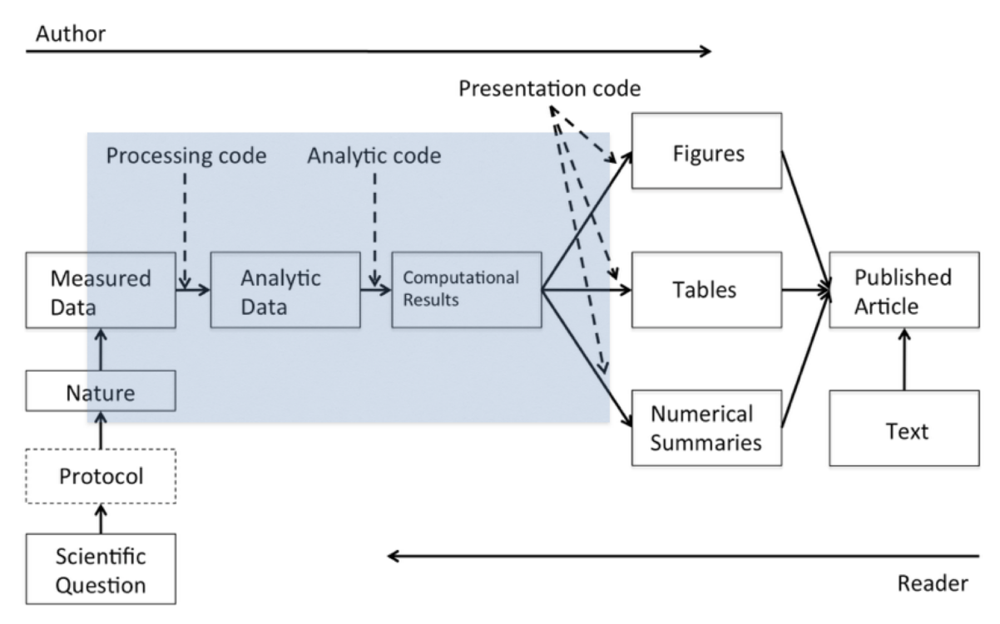
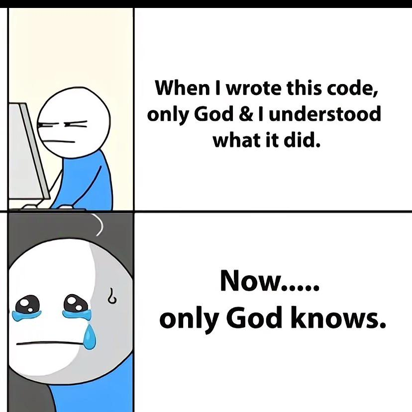

## Proceso de creación de reportes durante la investigación

Tradicionalmente, el proceso de investigación se puede describir de esta manera:

{fig-align="center"}

No obstante, este flujo de información muchas veces es insuficiente para comunicar cómo se generó el conocimiento, permitir el reuso de los datos y finalmente facilitar la reproducibilidad o reproducción del estudio. Por un lado en una investigación hay muchos pasos que generan conocimiento pero no llegan a los documentos finales (con suerte algunos llegan al material suplementario o a los repositorios de código que acompañan las investigaciones). Por otro lado, la gran cantidad de datos que existen actualmente permiten su utilización de distintas maneras. A veces en diferentes áreas o a veces en forma de síntesis. Esto hace más eficiente el uso de los recursos económicos y de los productos de la ciencia. Sin embargo, la falta de documentación en los conjuntos de datos dificulta o imposibilita ese proceso.

Adicionalmente, la robustez de los resultados en una investigación se beneficia de la confirmación de los mismos, ya sea mediante estudios independientes que los repitan o mediante la exploración de los análisis para reproducir los resultados de los autores. Sin embargo, no existe una manera estandarizada de comunicar la forma en que se deben ejecutar los análisis en un proyecto de investigación complejo, de forma en que sea reproducible. En algunos casos se hace mediante el texto, en otros mediante archivos con código, sin embargo, muchas veces no es suficiente y en el momento en el que queremos repetir o reproducir un análisis (incluso de nuestras propias investigaciones de tiempo atrás) no lo logramos.

{width=60% align=center fig-align="center"}

### Problemas

- Dejar listos los resultados de forma que sean reproducibles requiere un esfuerzo considerable 
- Los lectores deben descargar los datos/resultados y entender cómo se realizó el análisis
- Puede haber diferencias entre los recursos/paquetes/equipos que tienen los lectores y los autores
- Existen pocas herramientas que ayuden a autores/lectores -> está creciendo

### Opciones 

Una opción que existe es la generación de documentos que combinen texto/imágenes/diagramas con código y datos. Múltiples documentos se pueden ligar de manera que el análisis completo sea reproducible y las decisiones de los autores sean claras.

- Rmarkdown (R + texto)
- Jupyter Notebooks (python + texto)
- Sweave (Latex + texto)

[Quarto](https://quarto.org/) fue creado como un programa aislado que permite la creación de documentos que mezclan texto con código, además de que está diseñado para permitir el uso de diferentes lenguajes de programación (R, python, Julia, Observable JS). Se puede utilizar en diferentes plataformas y permite la creación de diferentes clases de documentos (presentaciones, html, pdf, artículos, libros, dashboards), que tienen diferentes capacidades (dinámicos vs estáticos).


## Diferencias entre Quarto y Rmarkdown 

En escencia, para los usuarios de R, Quarto funciona de una manera muy similar que R markdown. Quarto fue creado para mejorar la colaboración entre científicos y técnicos. Ahora es un sistema independiente que integra muchas de las funciones que se desarrollaron con R markdown.

Una de las diferencias y ventajas importantes es la compatibilidad de Quarto con múltiples plataformas (p. e. knitr y jupyter notebooks). Quarto es independiente de R, está diseñado para funcionar con distintos lenguajes y está diseñado para acomodar lenguajes que no existen. 

Sin embargo, Rmarkdown seguirá teniendo soporte, aunque algunas de las funcionalidades que desarrollarán en el futuro se realizarán en Quarto.

## Tipos de documentos que se pueden hacer en Quarto

Los formatos básicos que se pueden realizar en Quarto son:

- [html](https://quarto.org/docs/output-formats/html-basics.html)
- [pdf](https://quarto.org/docs/output-formats/pdf-basics.html)
- [word](https://quarto.org/docs/output-formats/ms-word.html)
- [diapositivas html](https://quarto.org/docs/presentations/revealjs/)
- [libros](https://quarto.org/docs/books/)
- [dashboards](https://quarto.org/docs/dashboards/)


## Estructura de un documento de Quarto


## Dónde buscar ayuda y más funcionalidades


## Introducción al lenguaje de markdown

Es una herramienta para escribir texto simple que originalmente servía para escribir en la web.

> "Markdown is a text-to-HTML conversion tool
for web writers. Markdown allows you to write
using an easy-to-read, easy-to-write plain text
format, then convert it to structurally valid XHTML
(or HTML)." John Gruber

Es un tipo de "lenguaje" que se caracteriza porque se puede leer sin un formato especial, a diferencia de otros lenguajes como HTML.

La sintaxis es simple y no requiere de aprenderse demasiados comandos. En realidad puedes simplemente utilizarlo como documento de texto. 

::: {.callout-tip appearance="simple"}
## Introducción completa a Markdown

En la [página de ayuda](https://quarto.org/docs/authoring/markdown-basics.html#text-formatting) de Quarto puedes encontrar la mayoría de la sintáxis básica que necesitarás. 

Una traducción al español de esa página la puedes encontrar en el archivo intro_markdown.qmd del taller.

:::


::: {.callout-note collapse="true"}
## Sintaxis en el texto
+-----------------------------------------+-----------------------------------------+
| Markdown Syntax                         | Output                                  |
+=========================================+=========================================+
| ``` markdown                            | *italics*, **bold**, ***bold italics*** |
| *italics*, **bold**, ***bold italics*** |                                         |
| ```                                     |                                         |
+-----------------------------------------+-----------------------------------------+
| ``` markdown                            | superscript^2^ / subscript~2~           |
| superscript^2^ / subscript~2~           |                                         |
| ```                                     |                                         |
+-----------------------------------------+-----------------------------------------+
| ``` markdown                            | ~~strikethrough~~                       |
| ~~strikethrough~~                       |                                         |
| ```                                     |                                         |
+-----------------------------------------+-----------------------------------------+
| ``` markdown                            | `verbatim code`                         |
| `verbatim code`                         |                                         |
| ```                                     |                                         |
+-----------------------------------------+-----------------------------------------+
:::

::: {.callout-note collapse="true"}
## Encabezados 

+------------------+-----------------------------------+
| Markdown         | Resultado                         |
+==================+===================================+
| ``` markdown     | # Heading 1 {.heading-output}     |
| # Heading 1      |                                   |
| ```              |                                   |
+------------------+-----------------------------------+
| ``` markdown     | ## Heading 2 {.heading-output}    |
| ## Heading 2     |                                   |
| ```              |                                   |
+------------------+-----------------------------------+
| ``` markdown     | ### Heading 3 {.heading-output}   |
| ### Heading 3    |                                   |
| ```              |                                   |
+------------------+-----------------------------------+
| ``` markdown     | #### Heading 4 {.heading-output}  |
| #### Heading 4   |                                   |
| ```              |                                   |
+------------------+-----------------------------------+
| ``` markdown     | ##### Heading 5 {.heading-output} |
| ##### Heading 5  |                                   |
| ```              |                                   |
+------------------+-----------------------------------+
| ``` markdown     | ###### Heading 6 {.heading-output}|
| ###### Heading 6 |                                   |
| ```              |                                   |
+------------------+-----------------------------------+

: {tbl-colwidths="[50, 50]"}

:::

::: {.callout-note collapse="true"}
## Vínculos e imágenes

+------------------------------------------------------------------------+--------------------------------------------------------------------------------------------------------+
| Markdown Syntax                                                        | Output                                                                                                 |
+========================================================================+========================================================================================================+
| ``` markdown                                                           | <https://quarto.org>                                                                                   |
| <https://quarto.org>                                                   |                                                                                                        |
| ```                                                                    |                                                                                                        |
+------------------------------------------------------------------------+--------------------------------------------------------------------------------------------------------+
| ``` markdown                                                           | [Quarto](https://quarto.org)                                                                           |
| [Quarto](https://quarto.org)                                           |                                                                                                        |
| ```                                                                    |                                                                                                        |
+------------------------------------------------------------------------+--------------------------------------------------------------------------------------------------------+
| ``` markdown                                                           | [Markdown Basics](./markdown-basics.qmd)                                                               |
| [Markdown Basics](./markdown-basics.qmd)                               |                                                                                                        |
| ```                                                                    |                                                                                                        |
+------------------------------------------------------------------------+--------------------------------------------------------------------------------------------------------+
| ``` markdown                                                           | [Markdown Basics - Links & Images](./markdown-basics.qmd#links-images)                                 |
| [Markdown Basics - Links & Images](./markdown-basics.qmd#links-images) |                                                                                                        |
| ```                                                                    |                                                                                                        |
+------------------------------------------------------------------------+--------------------------------------------------------------------------------------------------------+
| ``` markdown                                                           | [Markdown Basics - Links & Images](#links-images)                                                      |
| [Markdown Basics - Links & Images](#links-images)                      |                                                                                                        |
| ```                                                                    |                                                                                                        |
+------------------------------------------------------------------------+--------------------------------------------------------------------------------------------------------+
| ``` markdown                                                           | {fig-alt="A line drawing of an elephant."}                                 |
|                                            |                                                                                                        |
| ```                                                                    |                                                                                                        |
+------------------------------------------------------------------------+--------------------------------------------------------------------------------------------------------+
: {tbl-colwidths="[50, 50]"}


:::

::: {.callout-note collapse="true"}
## Listas

+-----------------------------------+---------------------------------+
| Markdown Syntax                   | Output                          |
+===================================+=================================+
| ``` markdown                      |                                 |
| * unordered list                  | * unordered list                |
|   + sub-item 1                    |   + sub-item 1                  |
|   + sub-item 2                    |   + sub-item 2                  |
|     - sub-sub-item 1              |     - sub-sub-item 1            |
| ```                               |                                 |
+-----------------------------------+---------------------------------+
| ``` markdown                      |                                 |
| *   item 2                        | -   item 2                      |
|                                   |                                 |
|     Continued (indent 4 spaces)   |     Continued (indent 4 spaces) |
| ```                               |                                 |
+-----------------------------------+---------------------------------+
| ``` markdown                      |                                 |
| 1. ordered list                   |  1. ordered list                |
| 2. item 2                         |  2. item 2                      |
|    i) sub-item 1                  |     i) sub-item 1               |
|       A.  sub-sub-item 1          |        A.  sub-sub-item 1       |
| ```                               |                                 |
+-----------------------------------+---------------------------------+
| ```` markdown                     |                                 |
| 1. ordered list                   |  1. ordered list                |
| 2. item 2                         |  2. item 2                      |
|                                   |                                 |
|    ```python                      |     ```python                   |
|    print("Hello, World!")         |     print("Hello, World!")      |
|    ```                            |     ```                         |
|                                   |                                 |
|    A.  sub-sub-item 1             |     A.  sub-sub-item 1          |
| ````                              |                                 |
+-----------------------------------+---------------------------------+
| ``` markdown                      |                                 |
| - [ ] Task 1                      | - [ ] Task 1                    |
| - [x] Task 2                      | - [x] Task 2                    |
| ```                               |                                 |
+-----------------------------------+---------------------------------+
| ``` markdown                      |                                 |
| (@)  A list whose numbering       |  (1) A list whose numbering     |
|                                   |                                 |
| continues after                   |  continues after                |
|                                   |                                 |
| (@)  an interruption              |  (2) an interruption            |
| ```                               |                                 |
+-----------------------------------+---------------------------------+
| ``` markdown                      |                                 |
| ::: {}                            | ::: {}                          |
| 1. A list                         | 1. A list                       |
| :::                               | :::                             |
|                                   |                                 |
| ::: {}                            | ::: {}                          |
| 1. Followed by another list       | 1. Followed by another list     |
| :::                               | :::                             |
| ```                               |                                 |
+-----------------------------------+---------------------------------+
| ``` markdown                      |                                 |
| term                              | term                            |
| : definition                      | : definition                    |
| ```                               |                                 |
+-----------------------------------+---------------------------------+
:::


:::{.callout-note collapse="true"}
## Ecuaciones

+---------------------------+-------------------------+
| Markdown Syntax           | Output                  |
+===========================+=========================+
| ``` markdown              |                         |
| inline math: $E = mc^{2}$ | inline math: $E=mc^{2}$ |
| ```                       |                         |
+---------------------------+-------------------------+
| ``` markdown              |                         |
| display math:             | display math:           |
|                           |                         |
| $$E = mc^{2}$$            | $$E = mc^{2}$$          |
| ```                       |                         |
+---------------------------+-------------------------+
:::


## Código en un documento (html y pdf)

Para agregar un bloque de código ("chunk") puedes utilizar el atajo `ctrl + alt + i`

El bloque se compone de diferentes partes
```{{r}} 
#| <opciones del chunk>

<codigo>

```

1. Lenguaje de programación `{r}` - puedes usar `{python}`, `{markdown}`, etc.
2. [Opciones del chunk](https://quarto.org/docs/reference/cells/cells-knitr.html) - se especifican utilizando `#|` al principio, seguido de la etiqueta que queremos utilizar y la opción para esa etitqueta. Por ejemplo para asignar un nombre al chunk usamos `#| label: fig-airquality`
3. Código 

Ejemplo: 

```{r}
#| label: fig-airquality
#| fig-cap: "Temperature and ozone level."
#| warning: false

library(ggplot2)

ggplot(airquality, aes(Temp, Ozone)) + 
  geom_point() + 
  geom_smooth(method = "loess")
```

Las opciones más comunes que se pueden modificar en los chunks son:

- `#| label: fig-airquality`: nombre de la figura/tabla/chunk para poder ser referenciados más adelante
- `#| echo: true`: mostrar (true) o no (false) el código
- `#| eval: true`: evaluar o no el código 


## Imágenes

Las imágenes se pueden incluir usando markdown, html o utilizando código (por ejemplo usando el paquete knitr).

#### Markdown 

```markdown


## Ejemplo

{#fig-elefante00}

```

{#fig-elefante00}

Se pueden modificar algunos parámetros de la imagen usando etiquetas:

```markdown
{#fig-elefante0 width="50%" fig-align="center"}

```

{#fig-elefante0 width=50% fig-align="center"}

Se pueden utilizar bloques de HTML (div) para organizar las imágenes en columnas

::: {#fig-elephants layout-ncol=2}

{#fig-elephant1}

{#fig-elephant2}

Elefantes famosos
:::

#### HTML


```html

```

 

#### Knitr

Se puede utilizar la función include_graphics del paquete knitr para agregar una imagen. Las propiedades de la imagen se controlan por medio de las opciones de chunk.

```{.r}
#| echo: false
#| out-width: 50% 
#| fig-align: center

library(knitr)

knitr::include_graphics("img/elephant.png")
```


```{r}
#| echo: false
#| out-width: 50% 
#| fig-align: center

library(knitr)

knitr::include_graphics("img/elephant.png")
```


## Tablas


## Modificación de formato


## Proyectos de Quarto