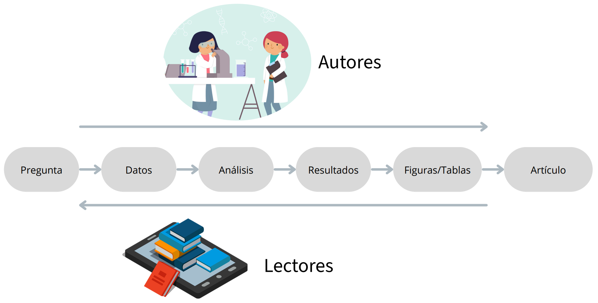
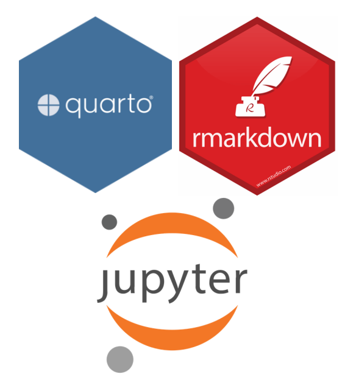
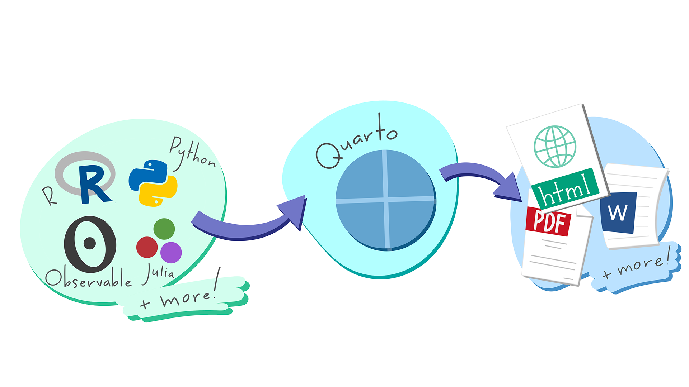

## Flujo de trabajo científico

{fig-align="center"}

## A veces el flujo de información es insuficiente

:::{.columns}
:::{.column width="40%"}

<br>

- Muchos pasos de la investigación no se documentan
- La documentación de los datos a veces es insuficiente
    - No se pueden reutilizar
- No se pueden reproducir

:::
:::{.column width="60%"}

{fig-align="center" width="90%"}
:::
:::


## Problemas

<br>

- Dejar listos los resultados de forma que sean reproducibles requiere un esfuerzo considerable
- Los lectores deben descargar los datos/resultados y entender cómo se realizó el análisis
- Puede haber diferencias entre los recursos/paquetes/equipos que tienen los lectores y los autores
- Existen pocas herramientas que ayuden a autores/lectores -> está creciendo

## Opciones

:::{.columns}
:::{.column left="50%"}

<br>
<br>

- Rmarkdown (R + texto)
- Jupyter Notebooks (python + texto)
- Sweave (Latex + texto)

:::
:::{.column right="50%"}

{width="80%"}

:::
:::

## Quarto

{fig-align="center"}

## Diferencias entre Rmarkdown y Quarto {.smaller}

:::{.columns}
:::{.column left="60%"}

<br>

- En escencia, para los usuarios de R, Quarto funciona de una manera muy similar que R markdown.

- Quarto es independiente de R

- Quarto integra muchas de las herramientas que se desarrollaron en Rmarkdown

- Rmarkdown siempre tendrá soporte pero nuevas funcionalidades quizá estén concentradas en Quarto


:::
:::{.column right="40%"}

<br>
<br>
<br>
<br>


:::
:::

## Tipos de documentos

<iframe
  src="https://quarto.org/docs/gallery/"
  width="100%"
  height="600px"
  style="border:none;">
</iframe>

## Estructura de un documento de Quarto

:::{.columns}
:::{.column left="50%"}

<br>
<br>
<br>

1. Encabezado (YML)
2. Texto (utilizando markdown)
3. Código


:::
:::{.column right="50%"}

{width="80%"}

:::
:::

## YML

:::{.columns}
:::{.column left="50%"}

<br>
<br>

```{.r}
---
title: "Reporte de Quarto"
date: today
author: "Sofía Zorrilla Azcué"
format: html
---

## Introducción

## Objetivos


```

:::
:::{.column right="50%"}

<br>
<br>

<iframe
  src="partials/test.html"
  width="100%"
  height="600px"
  style="border:none;">
</iframe>

:::
:::

# Ejercicio {.ejercicio}

# md

## Sintaxis en el texto



## Encabezados



## Vínculos e imágenes {.smaller}



## Listas {.scrollable}



## Ecuaciones



# Ejercicio {.ejercicio}

# Código

## Partes del código

- Para añadir un chunk puedes usar el atajo `ctrl + alt + i` 
- El chunk se define por ```{r}, r es el lenguaje de programación
- Las características del chunk son definidas por `#|`

:::{.columns}
:::{.column left="50%"}

```{.r code-line-numbers="|1|2-4|"}
```{.r}
#| label: fig-airquality
#| fig-cap: "Temperature and ozone level."
#| warning: false

library(ggplot2)

ggplot(airquality, aes(Temp, Ozone)) + 
  geom_point() + 
  geom_smooth(method = "loess")
```
```

:::
:::{.column right="50%"}

```{r}
#| label: fig-airquality
#| fig-cap: "Temperature and ozone level."
#| warning: false

library(ggplot2)

ggplot(airquality, aes(Temp, Ozone)) + 
  geom_point() + 
  geom_smooth(method = "loess")
```

:::
:::

##